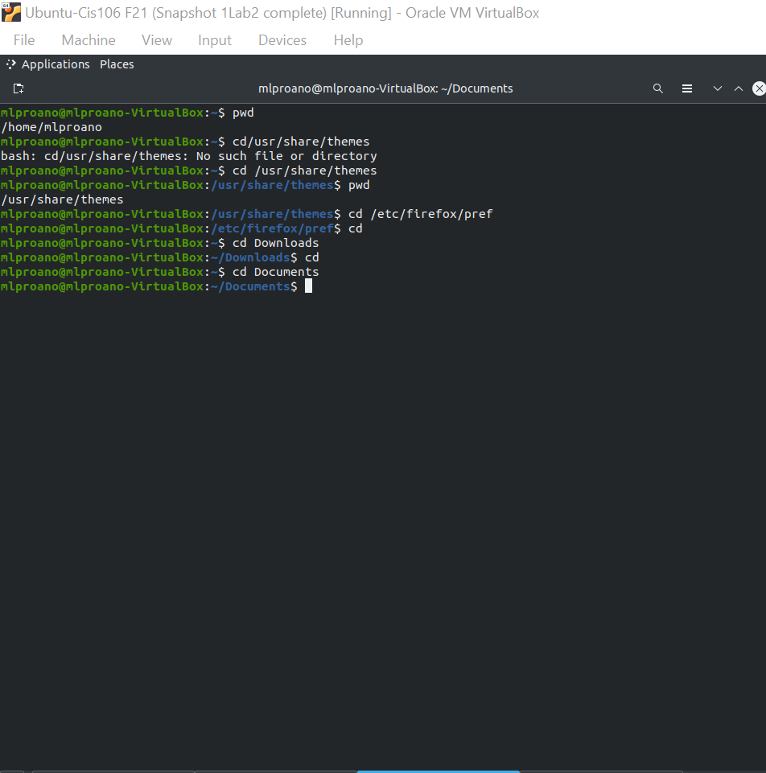
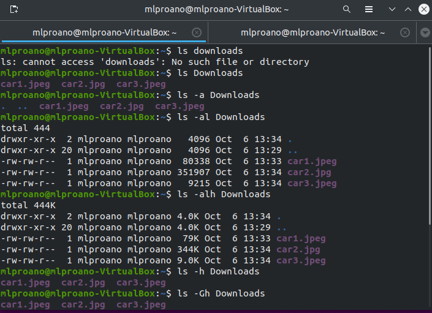
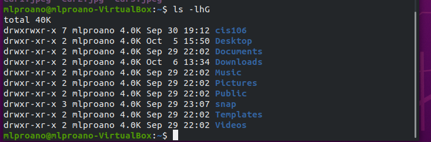
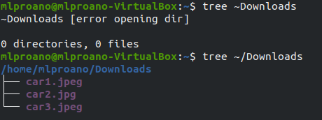
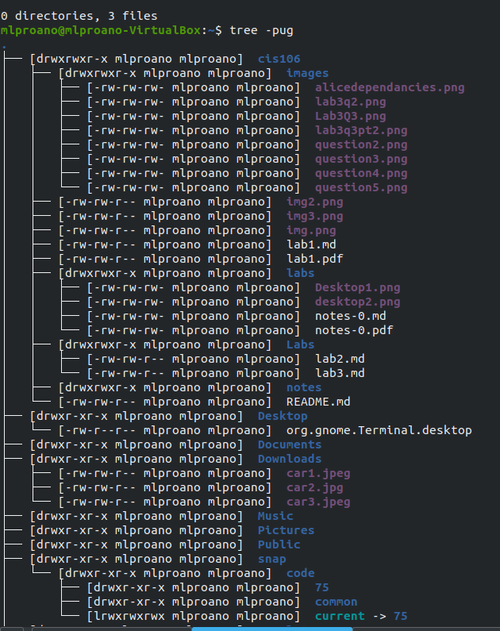
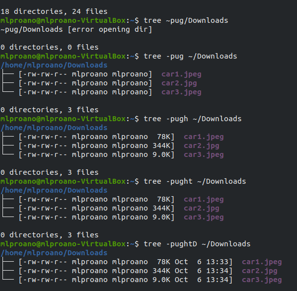
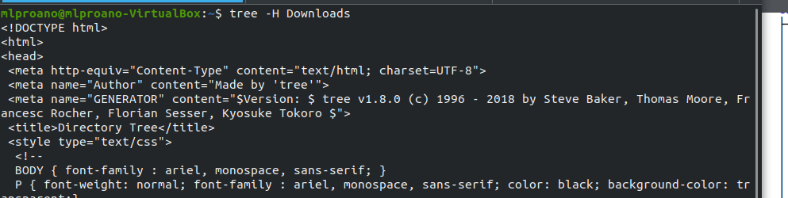
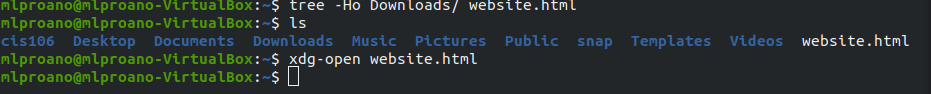
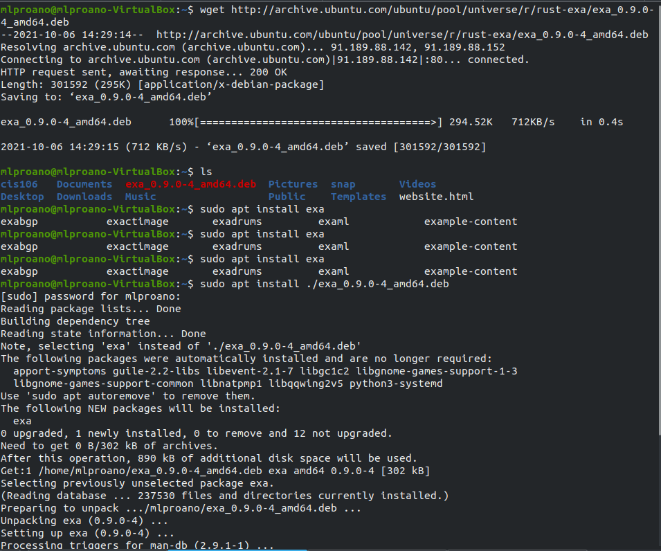
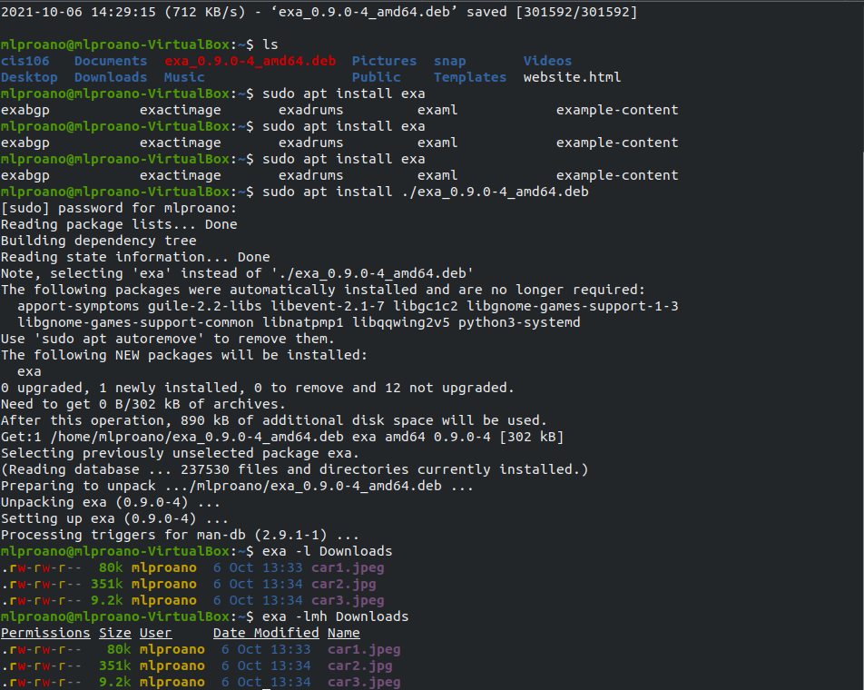

# Lab 3 | Installing software and navigating the file system | Answers
Assignment description [here](https://raw.githubusercontent.com/ra559/cis106/main/labs/lab3.md)

## Question 1
1. Which command did you use to search for the themes and to install them? 
- apt search - to search for the package 
- sudo apt install (name of package)
1. Which commands did you use to find and install the web browser? sudo apt install alice
3.1 What is the name of the package? games-racing
3.2 What dependencies are needed in order to install the package? (you can either take a screenshot of the terminal or copy and paste from the terminal)
    antigravitaattori armagetronad armagetronad-common bloboats extremetuxracer extremetuxracer-data
    fonts-cantarell fonts-noto-core fonts-noto-ui-core freeglut3 games-racing games-tasks gltron
    liballegro4.4 libalut0 libccd2 libclanapp-1.0v5 libdevil1c2 libftgl2 libglew2.1 libglfw3 libilmbase24
    liblua5.1-0 libmcpp0 libmng2 libnetpbm10 libode8 libphysfs1 libplib1 libraqm0 libsdl-net1.2
    libsdl-sound1.2 libsdl2-image-2.0-0 libsfml-audio2.5 libsfml-graphics2.5 libsfml-system2.5
    libsfml-window2.5 libsquish0 libtinyxml2-6a libtinyxml2.6.2v5 libxdg-basedir1 netpbm pink-pony
    pink-pony-data pyracerz stormbaancoureur stormbaancoureur-data supertuxkart supertuxkart-data tasksel
    tasksel-data torcs torcs-data trigger-rally trigger-rally-data trophy trophy-data ttf-dejavu-core
    xmoto xmoto-data xracer

3.3 How much disk space will the package utilize after installation? 
1,611 MB of additional disk space will be used.

 
 

## Question 2

## Question 3

## Question 4

## Question 5

