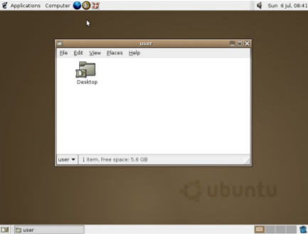
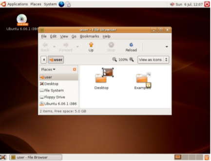

# What is Ubuntu?

## What is Ubuntu?
Ubuntu is a complete Linux operating system, freely available with both community and professional support. Ubuntu is
suitable for both desktop and server use. The current Ubuntu release supports Intel x86 (IBM-compatible PC), AMD64 (x86-64), ARMv7, ARMv8 (ARM64), IBM POWER8/POWER9 (ppc64el), IBM Z zEC12/zEC13/z14 and IBM LinuxONERockhopper I+II/Emporer I+II (s390x). Ubuntu includes thousands of pieces of software, starting with the Linux kernelversion 5.4 and GNOME 3.28, and covering every standard desktop application from word processing and spreadsheet applications to internet access applications, web server software, email software, programming languages and tools and of course several games.

## A little bit of Ubuntu’s background
### The Ubuntu vision
* In April 2004 Mark Shuttleworth brought together a group of developers from the Debian project, GNOME, and
GNU. The goal of the meeting was to answer the following questions:
   * Is a batter type of operating system possible?
    * What would this OS look like?
    * Can you describe the community that would build this project?
* Before Ubuntu, installing Linux was a project for computer enthusiasts. Linux on the desktop was considered a
computer nerd only operating system because it was difficult to install and maintain for a regular computer user.
* Ubuntu 4.10 (Warty Warthog), released on 20 October 2004. It was Canonical's first release of Ubuntu and it
looked like this:

* Ubuntu 6.06 (Dapper Drake), released on 1 June 2006, was Canonical's fourth release and the first long-term
support (LTS) release. It looked like this:

#### Ubuntu flavors
An ubuntu flavor is an operating system based on ubuntu that uses a different desktop environment than the default Ubuntu’s desktop environment (GNOME). Ubuntu flavors offer a unique way to experience Ubuntu, each with their own choice of default applications and settings. Ubuntu flavors are backed by the full Ubuntu archive for packages and
updates.
#### Ubuntu has 7 official flavors:
|Logo | Flavor | Download Link |
|-----|--------|---------------|
| | Kubuntu | https://kubuntu.org/getkubuntu/ 
 | Lubuntu | https://lubuntu.net/downloads/
 | Ubuntu Budgie | https://ubuntubudgie.org/downloads
 | Ubuntu Kylin | https://www.ubuntukylin.com/downloads/show.php?id=451&lang=en
 | Ubuntu Mate | https://ubuntu-mate.org/download/ 
 | Ubuntu Studio | https://ubuntustudio.org/download/
 | Xubuntu | https://xubuntu.org/download/
Ubuntu also serves as a base for a large number of Linux distributions. Some people call those Linux distributions Ubuntu
distributions because they heavily rely on Ubuntu’s active development cycle.
#### Some Ubuntu distributions are:
* Linux Mint
* Pop!_OS
* elementary OS
* Zorin OS
* Linux Lite
* Peppermint OS
* BackBox Linux
