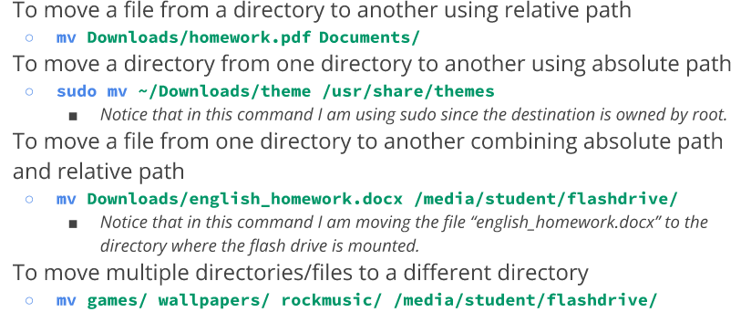

$Matthew$ $Proano$

- Command -option argument 
Ex. ls -l ~/Downloads
## Creating directories
- mkdir+ the name of directory

- using RELATIVE PATH = mkdir wallpapers/ocean
- using ABSOLUTE PATH = mkdir ~/wallpapers/forest
## Creating files

## Deleting files and directories 
The rm command 
-rm removes ONLY FILES 
-rm -r is to remove DIRECTORIES
to remove empty directories use rmdir 

## Moving and copying files and directories
###Mv command 
mv moves and renames directories 
  mv + source +destination
renaming a file/ directory 
- mv + file/directory current name + new name 

##index files/ inodes
Inode is the data structure that has all the info about a file but not the name and the content. The files have an index number. LS -I will show the inode number
Using the stat command can also give inode data
## Hard links and creating them
HArd links are files that point to data on the hard drive. when linked to data it stored in hard drive w inode number.
The links must be deleted so data can be as well
ln file ~/Downloads/fileHl
## Soft links 
if soft link is modified then target file is 2
ln -s file fileSL
## Getting help 
man + command
## Wildcards 
wildcard help find letters or characters used in a filename or searches
EX. ls *.txt
### ? is for1 character
EX. ls .??*
### []wildcard

## Brace expansion
