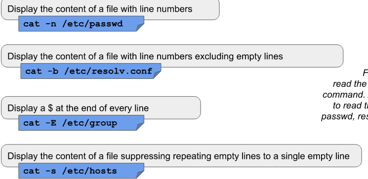
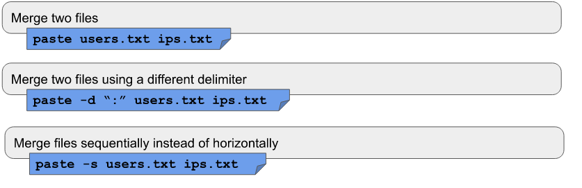
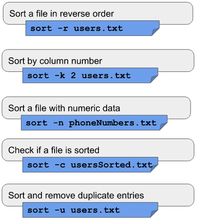
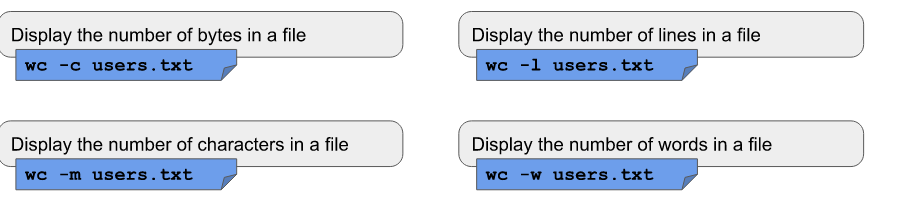
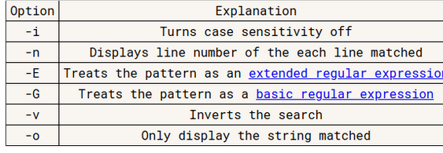
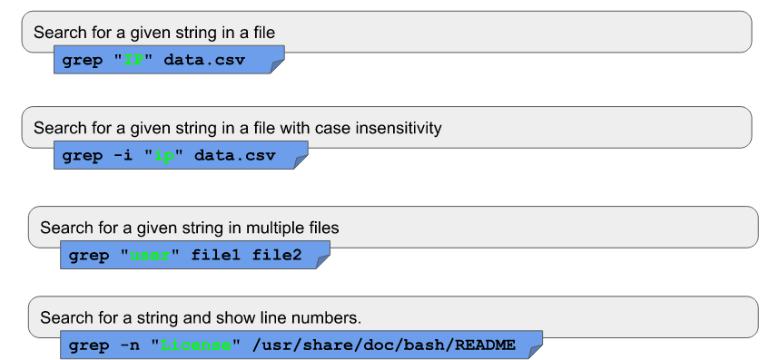
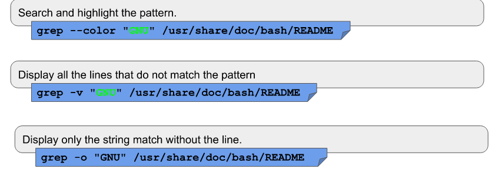
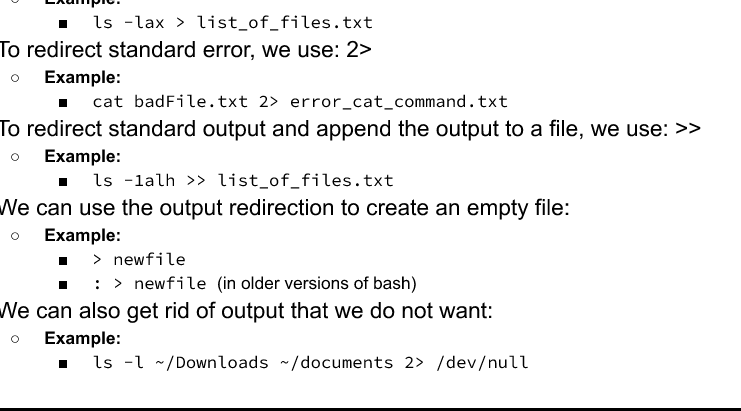
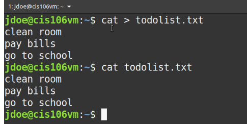
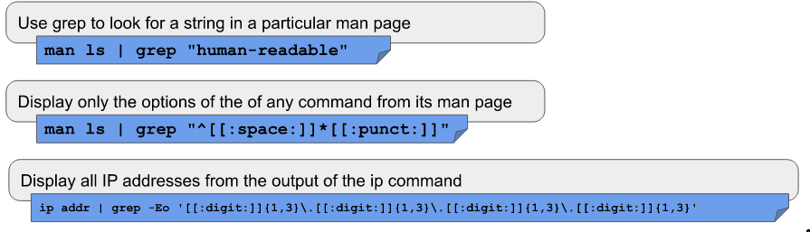

$matthew$ $Proano$
##Cat
  Cat meaning to join two strings togethor
  ex. cat + file + file2
  
##tac
To display the content of file in reverse
tac + file + file2
## more
basically display the content of a fille one page at a time
more + file to view
more -10 /var/log/syslog
## less
faster than more loads 1 page at a time
less -N /var/log/syslog
less -p "nobody" /etc/passwd
##head
dispays the first 10 lines of file
head + option +file
head -5 /etc/passwd
##diff
##tail
Display the last ten lines 
tail + option + file 
##Cut
cut + option +file
cut -d : -f1 /etc/passwd this is to display a list of user in a linux system
##paste
uses to merge files together 

##sort
lets to sort files, goes line by line,
sort -o usersSorted.txt users.txt 
(users.txt is the new file) 

##wc
is used to print number of lines, characters and bytes in a file

##tr

##grep 
is used to find a string pattern from a file 
How to use 
Grep + option + pattern to match + file
OR
standard output + pipe + grep +pattern to match

## file descriptors 
used to describe open files in a session
allowed 9 descriptors at a time

## cat command 
use cat 
then type 
while using cat can redirect the output of cat to any file

## Pipe command |
The pipe alloes to direct the output of a command into an input
command 1 + | + command2 | 

## Alias 
a shorthand for a complicated command