$Matthew$ $Proano$
## VIM
VIM beats Vi by alot of features
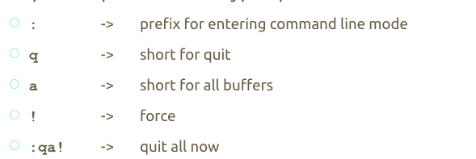
###insert text
pressing i is used for inserting text
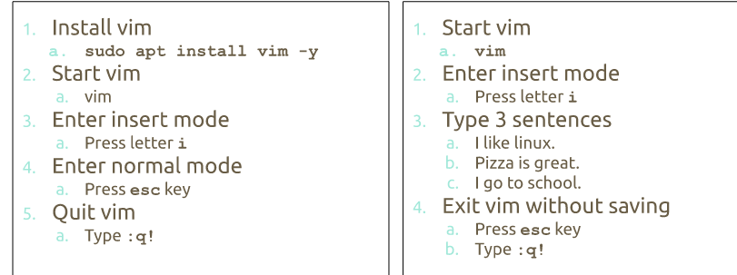
### Saving a file & quitting
the command w is used for saving and quitting
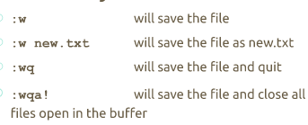
### moving in vim 
between sentences ()
between paragraphs {}
10e or w will move ten words 
###Searching words in vim
use / to look for words 
? will search backwards 
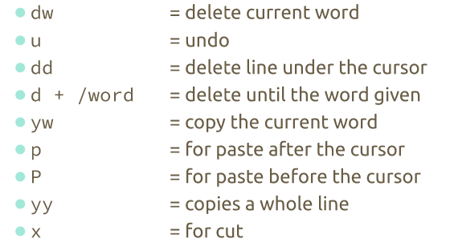

## Managing Data
basic terms
 + backup- copies files and directories to archive 
 + system backup- used to restore data in case of a system failure. 
 + archive- file having other files 
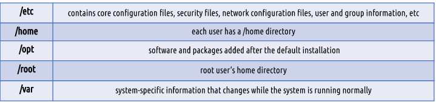
### TAR program
to create an archive
+ tar + options + archive name + files to add
to extract an archive 
+ tar + option + file to extract
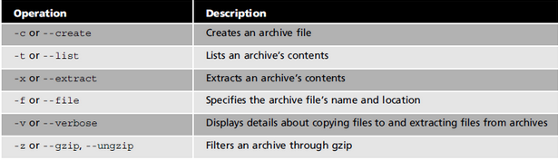
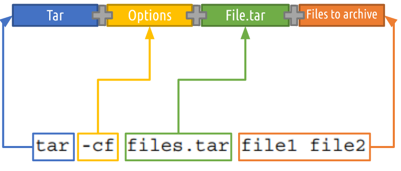
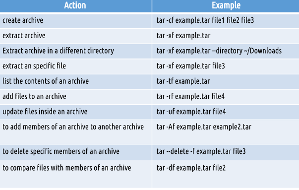
## Cpio program
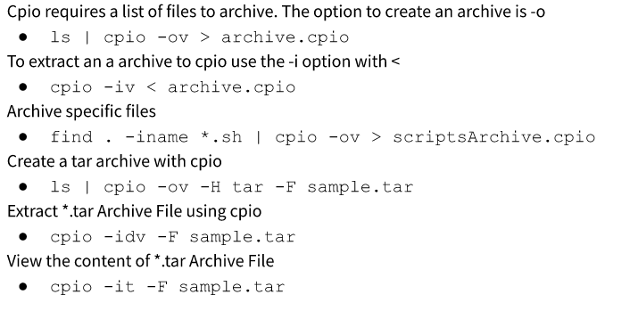
These are just basic uses of the cpio program
## File compression
Ex. file.txt.gz =gzip
or file.txt.bz2 = bzip2
or file.txt.xz =xz
bzip2 offers better compression
xz is the best 
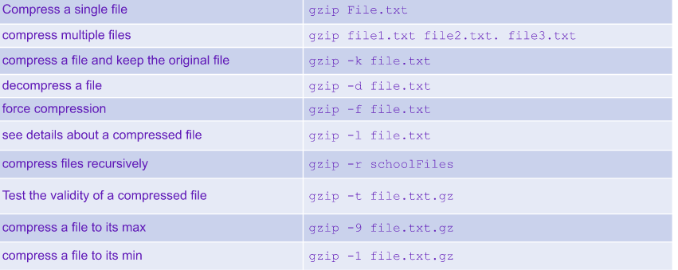
How to use 7zip (works the same with zip and rar)
7z + option +filename.7z + files to archive
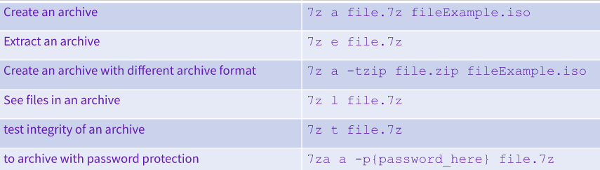
#Linux File Permissions
ls -l shows the owner (group/person)
etc/passwd had a list of all users
etc/group has all groups
chown is for changing group owner
chmod permissions file/directories
##numeric notation
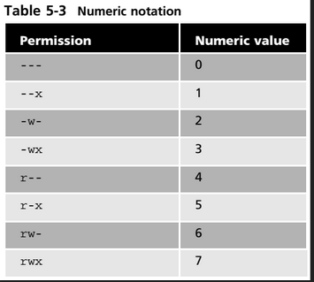

Examples
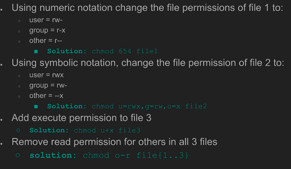