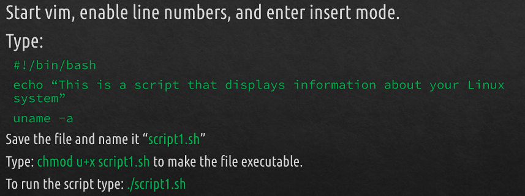
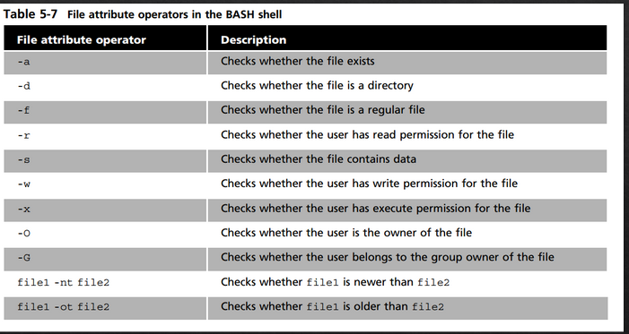

#Shell Scripting
compiler: a program used for converting complete source code into machine code
interpreter: a program that complete source code into machine code line by line
How to create a basic script

Variable = place holder for data

$HOME IS THE CURRENT HOME DIRECTORY
$SHELL is the current working shell 
$USER IS THE CURRENT WORKING USER
